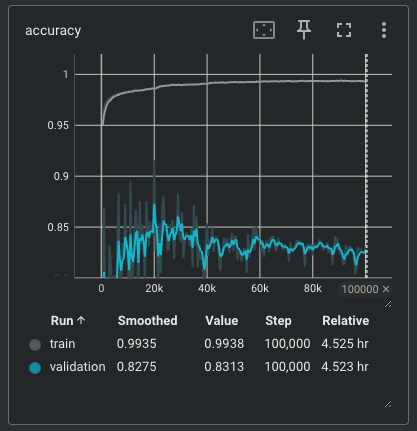
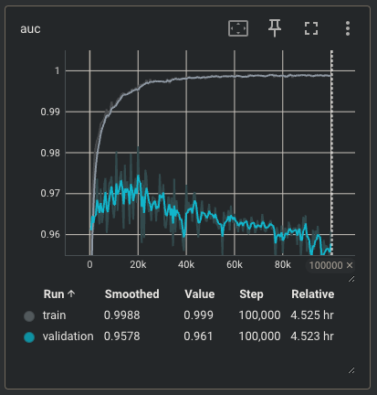
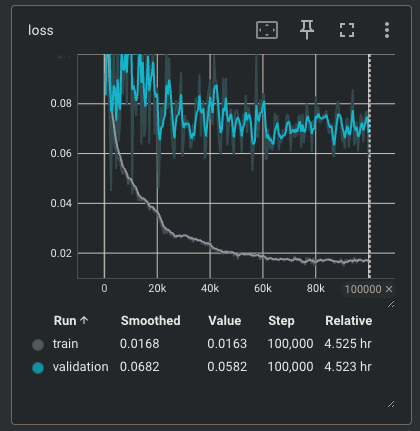

# How to analyze training metrics

In this graph we can see that the accuracy is stable at $\approx$ 0.97 after 20-40k training steps, so maybe the ideal amount of training steps lies in that range.

This is also confirmed by the AUC graph, showing that this metric - on the validation set - starts to drop slightly after 20k training steps, which is not good.

For the loss, it's good that the value drops but on the validation step the drop isn't as much as expected... Btw it still shows that 20-40k training steps are pretty much enough.

